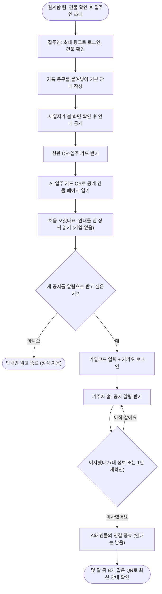
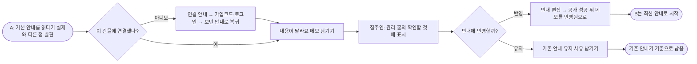

# 월계함 서비스 제안서

**사람은 바뀌어도, 건물은 남을 수 있도록.**

| 항목 | 내용 |
|---|---|
| 대회 | 2026 광운대학교 KW해커톤 |
| 주제 | 월계1동 지역문제 해결을 위한 웹·애플리케이션 개발 |
| 세부 주제 | 04 배리어프리 및 생활 편의 |
| 팀 | 삼삼오오 (Team 3355) |
| 관련 문서 | 화면 흐름 [lofi/board.html](lofi/board.html), 화면·개발 계약 [lofi/screens.md](lofi/screens.md), 함이 가이드 [design/characters/hami](design/characters/hami/README.md) |

이 문서는 무엇을 왜 만드는지를 다룹니다. 화면별 상태, 권한, 데이터 규칙처럼 어떻게 동작하는지는 [lofi/screens.md](lofi/screens.md)가 기준입니다.

---

## 1. 한 줄 요약

월계함은 관리사무소 없는 월계1동 소규모 임대건물마다 **생활정보의 주소**를 만드는 서비스입니다. 사람을 모으는 방이 아니라 건물 페이지를 먼저 만듭니다. 사람은 그 페이지에 잠시 연결됐다가 떠나고, 안내는 건물에 남습니다.

---

## 2. 관찰: 9월 20일, '전체 공지'가 개인 카톡으로 왔습니다

팀원이 사는 월계1동 원룸 건물의 집주인이 아래 공지를 보냈습니다.

> 안녕하세요. 전체 공지입니다. 요즘 분리수거를 안 하고 쇼핑백에 쓰레기를 그냥 버리시는 분들이 있어서 청소하시는 분이 너무 힘들대요. (중략) 분리수거함도 건물 뒤편에 있어요. 부탁드려요.

처음에는 그냥 분리수거 공지라고 생각했습니다. 다시 읽어 보니 세 가지가 들어 있었습니다.

| 공지 속 문장 | 의미 |
|---|---|
| "청소하시는 분이 너무 힘들대요" | 누군가 겪은 불편 |
| "분리수거함도 건물 뒤편에 있어요" | 이 건물에서만 필요한 생활정보 |
| "부탁드려요" | 지금 사는 세입자에게 전하는 부탁 |

**반전이 있었습니다.** 같은 생활안내가 이미 현관에 A4로 붙어 있었습니다. 공지에 적힌 수거함 위치와 분리 방법도 그대로였습니다. 안내는 붙어 있었고, 분리수거 문제는 그대로였습니다.

> 건물은 그대로인데, 왜 이 건물에서 사는 법은 사람이 바뀔 때마다 다시 전해야 할까?

---

## 3. 발견: 안내는 있었습니다. '남는 곳'과 '닿는 곳'이 따로 있었습니다

| | 현관 안내문 | 개인 카톡 |
|---|---|---|
| 건물에 남음 | ○ | ✕ |
| 지금 사는 사람에게 닿음 | ✕ | ○ |
| 설문 | 규칙을 몰라 곤란을 겪음 **11/30명** | 공지를 개인 카톡·문자로 받음 **11/14명** (월계1동) |

A가 입주하면 개인 카톡으로 안내를 받습니다. A가 이사하면 그 카톡도 A의 휴대폰과 함께 떠납니다. 다음 입주자 B에게는 현관 안내문만 남습니다. **사람이 떠나면, 닿던 안내도 함께 떠납니다.**

### 3.1 설문 (월계1동 자취 생활 설문, 2026-09-24~25, 응답 30명 중 월계1동 14명)

| 발견 | 월계1동 14명 | 비교 |
|---|---|---|
| 집주인·관리인의 공지를 개인 카톡·문자로 받음 | 11명 | 월계1동 외 16명 중 5명 |
| 입주 때 현관 안내문으로 분리수거를 알고, 공지는 개인 카톡으로 받음 | 7명 | |
| 한 건물에 사는 사람에 대해 "누가 사는지도 모른다" | 12명 | 전체 30명 중 23명 |
| 입주민 단톡방 없음 | 12명 | 전체 30명 중 27명 |
| 관리사무소·상주관리인 없음 | 7명 (모름 3명) | |

| 발견 | 전체 30명 |
|---|---|
| 건물 규칙을 몰라 겪은 일이 있음 (가장 많은 것은 쓰레기 방치·지적 6명) | 11명 |
| 이사할 때 다음 사람에게 넘기고 싶은 정보가 있었음 | 이사 경험자 14명 중 3명 |
| 한 건물에 사는 사람에게 전하고 싶은 말을 참음 | 12명 |
| 주관식: "하고싶은말이 있어도 신변보호를 위해 참게돼요" | 1건 |

### 3.2 팀원의 월계1동 입주 경험 (3회)

| 경험 | 내용 |
|---|---|
| 입주 설명 | 집주인과의 통화 또는 중개인을 통해서만 들었습니다. 간단히 듣고 궁금한 것을 물어보는 방식이라, 묻지 않으면 정보가 거기서 끊겼습니다. |
| 공지 | 세 번의 자취 동안 공지를 받은 것은 이번이 처음입니다. 대부분 개인 카톡이나 문자로 왔습니다. |
| 단체방 | 단체방이나 밴드로 관리하는 건물은 없었습니다. |

### 3.3 월계1동 밖의 사례

| 사례 | 내용 |
|---|---|
| 집주인이 만든 입주 안내서 | 한 다가구 집주인은 운영 경험을 바탕으로 입주 안내서를 직접 만들어, 호실마다 종이로 비치하도록 공유했습니다. 종이라서 고칠 때마다 다시 인쇄해야 합니다. |
| 전원 초대 단톡방 | 한 오피스텔 집주인이 공지를 전하려고 세입자 전원을 단톡방에 초대했습니다. 혼자 사는 세입자는 실명과 프로필 사진이 드러나는 것이 불안해 방을 나갔습니다. |

집주인은 이미 인계 문서를 만들고, 한 번에 공지하는 방법을 찾고 있습니다. 종이는 고쳐지지 않았고, 단톡방은 세입자를 드러냈습니다.

---

## 4. 월계1동: 이 구조가 반복될 조건이 있습니다

| 조건 | 수치 |
|---|---|
| 1. 관리사무소 없는 작은 임대건물 | 월계1동 전월세 계약의 **57%가 아파트 밖**(월계동 전체는 20%)이고, 그중 **94%가 다가구·다세대**입니다. 설문에서도 월계1동 14명 중 7명이 관리사무소·상주관리인이 없다고 답했습니다(모름 3명). |
| 2. 겨울에 몰리는 계약 | 아파트 외 주택의 전월세 계약은 **12~2월 석 달에 1년 계약의 47%**가 몰립니다. 월평균 12월 111건, 1월 90건, 2월 89건입니다. |

출처: 국토교통부 실거래가 공개시스템 전월세 자료. 월계동 자료를 도로명주소로 월계1동에 배정했습니다. 5,542건(2021.6~2026.9), 월평균은 2022~2025년 기준입니다.

관리사무소 없이, 겨울마다 계약이 몰리는 구조가 반복됩니다.

---

## 5. 문제 정의

### 5.1 정의

> 월계1동은 건물은 남고, 연결되는 사람이 계속 바뀌는 주거환경입니다.
>
> ① 안내는 한 사람씩 개인 카톡으로 갑니다.
> ② 세입자 계약은 겨울에 몰립니다.
> ③ 그래서 겨울마다, 안내가 사람과 함께 떠납니다.

### 5.2 Insight

| # | Insight | 근거 | 설계 원칙 |
|---|---|---|---|
| I-1 | **정보가 없는 것이 아니다. 정보가 남는 곳과 사람에게 닿는 곳이 갈라져 있다.** | 카톡 원문과 현관 A4, 설문 7명 | 원본은 건물 페이지 하나에 둔다. 카톡은 그 링크를 나르는 통로로 남긴다. |
| I-2 | **입주 인계는 질문에 의존한다. 처음 사는 건물에서 무엇을 모르는지는 알 수 없다.** | 팀원 입주 경험 3회, 규칙을 몰라 겪은 일 11명 | 묻기 전에 먼저 보여준다. 공개 건물 페이지와 '처음 오셨나요'가 이 건물에서 알아야 할 것을 한 장씩 보여준다. |
| I-3 | **전달 관계가 사람 단위라서 사람이 바뀔 때마다 다시 만들어진다.** | 월계1동 개인 카톡 공지 11명, 아파트 외 계약의 47%가 12~2월 | 사람과 건물의 관계는 시작하고 끝난다. 정보는 끝나지 않는다. |
| I-4 | **남는 정보는 낡는다.** [가정] | 현관 안내문은 규칙이 바뀌어도 고칠 경로가 없다. 집주인 인터뷰로 확인 예정 | 거주자가 차이를 알리고, 집주인이 반영하거나 유지한다. |

| # | 설계 조건 | 근거 | 설계 원칙 |
|---|---|---|---|
| D-1 | **한 건물에 산다고 서로의 관계가 생기지는 않는다.** | 월계1동 14명 중 12명이 누가 사는지 모름 | 이웃의 이름·번호·단체방 참여를 서비스 이용의 전제로 두지 않는다. 다른 거주자에게 신원을 보이지 않는다. |

| Core로 올리지 않은 것 | 근거 | 결정 |
|---|---|---|
| 떠나는 사람의 경험 전달 | 이사 경험자 14명 중 3명만 넘기고 싶은 정보가 있었음 | 생활 팁은 Optional로 둔다. |
| 이웃 간 소음·흡연 갈등 | 참은 사례의 대부분이 이웃 사이의 일 | 월계함은 이웃 분쟁을 중재하지 않는다. |

### 5.3 문제 정의 문장

> 관리사무소 없는 소규모 임대주거에서는 생활정보가 건물에 남아 있어도, 지금 사는 사람에게 전하는 경로는 개인 연락에 묶여 있습니다. 그래서 사람이 바뀔 때마다 필요한 생활맥락을 다시 이어야 합니다.

### 5.4 가설

| 항목 | 내용 |
|---|---|
| 가설 | 관리사무소 없는 월계1동 소규모 임대건물의 새 입주자는 건물 생활 규칙을 질문해야만 알 수 있어서, 모르는 채로 첫 주를 보낸다. 집주인이 한 번 등록한 건물 안내를 입주 카드 QR로 건네면, 새 입주자는 필요한 안내를 스스로 찾고, 집주인은 입주 때마다 반복하던 설명을 카드 한 장으로 대신한다. |
| 다시 볼 조건 | 집주인이 기본 안내 공개를 끝내지 못하거나, 입주 카드를 받은 세입자가 QR로 안내를 열지 않으면 이 가설을 다시 본다. |

### 5.5 JTBD

| ID | 대상 | When | Want to | So I can | But |
|---|---|---|---|---|---|
| JTBD-01 | 새 입주자 A·B | 처음 사는 건물에 들어왔을 때 | 분리수거·택배·보일러 사용법을 바로 알고 싶다 | 첫 주를 실수 없이 보낼 수 있다 | 지금은 통화나 중개인에게 짧게 듣고, 묻지 않은 것은 알 길이 없다 |
| JTBD-02 | 집주인 | 새 세입자가 들어오거나 건물에 알릴 일이 생겼을 때 | 한 번 적은 안내가 지금 사는 사람 모두에게 닿기를 원한다 | 같은 설명을 반복하지 않는다 | 지금은 세입자마다 통화하거나 개인 카톡을 보내고, 현관 안내문은 고쳐지지 않는다 |
| JTBD-03 | 현재 거주자 A | 살면서 새 공지가 생기거나, 안내가 실제와 다르다는 것을 알았을 때 | 공지를 놓치지 않고, 틀린 안내를 바로잡고 싶다 | 다음 사람이 틀린 안내로 시작하지 않는다 | 지금은 공지가 개인 연락으로만 오고, 현관 안내문을 고칠 경로가 없다 |
| JTBD-04 | 외부인 | 건물 앞에서 공용 공간 문제를 봤을 때 | 건물 책임자에게 알리고 싶다 | 알린 내용이 책임자에게 닿았는지 확인한다 | 지금은 집주인 연락처를 따로 찾아야 한다 |

### 5.6 HMW

> 어떻게 하면 사람을 위한 또 하나의 방을 만드는 대신, **건물 자체를 지속되는 생활정보 단위**로 만들 수 있을까요?

---

## 6. 이해관계자

| 구분 | 이해관계자 | 정의 | 역할 |
|---|---|---|---|
| Primary | 집주인 | 건물의 안내와 연락을 직접 맡는 사람 | 건물 페이지에 안내를 올리고, 현재 기준정보를 판단한다 |
| Primary | 세입자 A | 지금 살고 있고 이후 이사하는 사람 | 안내와 공지를 이용하고, 안내가 실제와 다르면 메모를 남긴다. 떠날 때 관계만 끝난다 |
| Primary | 세입자 B | A가 나간 뒤 들어오는 다음 입주자 | Core 가치를 가장 직접 경험한다 |
| Secondary | 외부인 | 청소 담당자, 이웃, 행인 | 공개 입구로 건물에 생긴 일을 알린다 |
| Operator | 월계함 팀 | 서비스 운영자 | 건물을 확인하고 집주인을 초대한다. 신고된 글을 처리한다 |
| Distribution | 공인중개사 | 계약을 중개하는 사람 | 입주 카드를 전달하는 통로 (운영 주체 아님) |
| Future | 월계1동 주민자치회 | 동 단위 주민 조직 | 현재 운영 주체로 두지 않는다 |

---

## 7. 고객여정지도 (지금)

| 단계 | 주요 인물 | 행동 | 터치포인트 | 감정 | 페인포인트 |
|---|---|---|---|---|---|
| ① 건물 준비 | 집주인 | 안내를 현관에 붙이고, 필요하면 개인 카톡으로 보낸다 | 현관 A4, 개인 카톡, 집주인의 기억 | 무심 | 안내가 세 곳에 흩어져 있다. 종이는 고치면 다시 붙여야 한다. |
| ② 계약·입주 | A, 집주인, 중개인 | 통화나 중개인을 통해 짧게 설명을 듣는다 | 전화, 중개인 | 막막함 | 묻지 않은 것은 알 수 없다. 설명은 기록으로 남지 않는다. |
| ③ 첫 주 생활 | A | 현관 안내문을 보거나 직접 부딪혀 알아낸다 | 현관 A4 | 불안 | 안내문이 낡았을 수 있다. 틀리고 나서 규칙을 안다. |
| ④ 공지가 필요할 때 | 집주인, A | 집주인이 같은 공지를 세입자 수만큼 복사해 보낸다 | 개인 카톡, 문자 | 번거로움 | 공지가 사람마다 흩어진다. 단톡방은 세입자를 드러낸다. |
| ⑤ 규칙이 바뀔 때 | A, 집주인 | 집주인이 개인 카톡을 다시 보낸다. 현관 안내는 그대로 둔다 | 개인 카톡, 현관 A4 | 혼란 | 최신 정보(카톡)와 남은 정보(A4)가 어긋난다. A는 고칠 경로가 없다. |
| ⑥ 퇴거 | A, 집주인 | A가 떠나고, 집주인은 연락 대상을 기억으로 정리한다 | 전화 | 무심 | A가 받은 공지는 A의 휴대폰과 함께 떠난다. |
| ⑦ 다음 입주 | B, 집주인 | 집주인이 처음부터 다시 설명한다 | 전화, 중개인 | 막막함 | ②로 돌아간다. 계약이 몰리는 겨울마다 반복된다. |
| ⑧ 건물에 일이 생길 때 | 외부인, A, B | 연락처를 아는 사람만 집주인에게 알린다 | 전화, 개인 카톡 | 망설임 | 연락처를 모르면 따로 찾아야 한다. 알린 뒤 처리 상태를 다시 확인해야 한다. |

**우선 개선 지점은 ② 계약·입주와 ③ 첫 주 생활입니다.** 새 입주자가 정보를 가장 필요로 하는 순간과, 집주인이 가장 반복해서 설명하는 순간이 여기서 겹칩니다. 이 순간이 반복되며 ⑦에서 다시 ②로 돌아가는 순환이 생깁니다.

---

## 8. 솔루션: 월계함

### 8.1 포지션

> 사람을 더 잘 묶는 방이 아니라, **건물의 생활정보 주소**를 만들었습니다. 월계함에서는 전달도 건물에서 시작합니다.

| 구분 | 내용 |
|---|---|
| 대상 | 관리사무소 없이 집주인이 직접 안내와 연락을 맡는 월계1동 원룸·다가구·다세대 |
| 기본 단위 | 건물 하나 = 페이지 하나 = 현관 QR 하나 |
| 만드는 사람 | 집주인. 월계함 팀이 확인한 건물에 초대받고, 기존에 카톡으로 보내던 안내를 한 번 붙여넣는다 |
| 보는 사람 | 누구나. QR을 열면 가입 없이 읽는다. 가입은 새 공지 알림을 받고 싶을 때만 한다 |
| 핵심 원리 | 건물은 기억하고, 사람은 잠시 연결되고, 말은 필요한 역할에게만 간다 |

| 누가 | 월계함에서 |
|---|---|
| 집주인 | 한 번 씁니다 |
| 세입자 | 가입 없이 읽고 이어받습니다 |
| 청소하시는 분·이웃 | 알립니다 |

### 8.2 기능의 위계

월계함의 기능은 따로 만든 기능의 묶음이 아닙니다. 건물 페이지가 먼저 있고, 모든 기능이 그 페이지에서 나옵니다.

| 위계 | 흐름 | 해결하는 것 |
|---|---|---|
| CORE 1 | 정보가 남기 시작한다 | 집주인이 카톡으로 보내던 안내를 한 번 옮기고, 공개 전에 확인한 뒤 입주 카드로 건넨다 (I-1) |
| CORE 2 | 처음부터 다시 찾지 않는다 | 새 입주자는 가입 없이 안내를 한 장씩 읽고, 원할 때만 연결한다 (I-2) |
| CORE 3 | 현재 사람에게 닿는다 | 집주인은 공지를 한 번 쓰고, 알림을 켠 사람은 알림으로, 아닌 사람은 같은 링크로 받는다 (I-1) |
| CORE 4 | 남은 정보가 낡지 않는다 | 거주자가 차이를 알리고, 집주인이 반영하거나 유지한다 (I-4) |
| CORE 5 | 사람이 바뀌어도 이어진다 | A와 건물의 관계만 끝나고, B는 같은 QR에서 최신 안내를 읽는다 (I-3) |
| SUPPORTING | 건물에 생긴 일을 집주인에게 | 공개 QR에서 비긴급 공용생활 상황을 알린다 (JTBD-04) |
| OPTIONAL | 거주 경험이 쌓인다 | 원하는 사람만 생활 팁을 남긴다 |
| 공통 조건 | 접근성·예외·시연 | 크게 보기, 읽어주기, 안내 없음, 건물을 찾을 수 없음, 시연 모드 |

새 기능을 검토할 때 기준은 하나입니다. **이 기능이 건물의 생활정보 주소를 강화하는가.** 수정 메모는 건물 정보를 최신으로 만드니 Core입니다. 생활 팁은 없어도 건물 정보가 성립하니 Optional입니다. 크게 보기와 읽어주기는 등급이 아니라 모든 화면의 조건입니다. 가입, 연락처, 단톡방 참여, 질문해야만 알 수 있는 구조 같은 **정보 접근의 장벽을 없애는 것**이 세부 주제 04에 대한 월계함의 답입니다.

### 8.3 하지 않는 것

| 하지 않는 것 | 이유 |
|---|---|
| 단톡방, 주민 SNS, 실시간 대화 | 이웃 관계를 전제하지 않는다 (D-1) |
| 이웃 분쟁 중재 | 제보는 비긴급 공용생활 상황만 받는다 |
| 민원 해결 보장 | 처리 상태는 집주인이 표시한 결과이며, 해결을 서비스가 보증하지 않는다 |
| 월세·계약 관리 | 임대관리 앱의 영역이다 |
| 호실 단위 기록, 세입자 실명 목록 | 신원을 드러내지 않는다. 어느 세입자가 연결했는지도 집주인에게 보여주지 않는다 |
| 모든 세입자의 가입 강제 | 공개 페이지만으로 정상 이용이 가능하다 |
| 소유권 인증 | 관리 권한은 월계함 팀이 확인한 건물에 초대로만 준다. 소유권을 증명하는 서비스라고 말하지 않는다 |
| 완전 익명 | 다른 거주자에게 작성자를 보이지 않지만, 시스템은 본인 글 관리와 신고 처리를 위해 작성자를 안다 |

---

## 9. 고객여정지도 (월계함 이후)

| 단계 | 누가 | 월계함에서 | 위계 | FR | 화면 |
|---|---|---|---|---|---|
| ① 건물 준비 | 집주인 | 초대 링크로 들어와 건물을 확인하고, 카톡 문구를 붙여넣어 기본 안내를 쓴다. 세입자가 볼 화면을 확인하고 공개한 뒤 현관 QR과 입주 카드를 받는다 | CORE 1 | FR-001~006 | LF-12, LF-14, LF-18, LF-13 |
| ② 계약·입주 | A, 집주인, 중개인 | 입주 카드 한 장을 건넨다. A는 QR로 가입 없이 기본 안내를 바로 본다 | CORE 2 | FR-007, 008 | LF-01, LF-02 |
| ③ 첫 주 생활 | A | '처음 오셨나요'로 안내를 한 장씩 읽는다. 새 공지를 원하면 마지막 장에서 가입코드로 연결한다 | CORE 2 | FR-009~011 | 첫날 카드, LF-04, LF-05 |
| ④ 공지가 필요할 때 | 집주인, A | 공지 원본 하나. 알림을 켠 사람은 알림으로, 알림을 받지 않는 사람은 같은 링크로 받는다 | CORE 3 | FR-012~014 | LF-15, LF-03, LF-04 |
| ⑤ 규칙이 바뀔 때 | A, 집주인 | "내용이 달라요" 메모를 남기면, 집주인이 반영하거나 유지한다 | CORE 4 | FR-015, 016 | LF-02, LF-13, LF-17 |
| ⑥ 퇴거 | A | 내 정보에서 이사를 확인하면 A와 건물의 관계만 끝나고, 안내는 건물에 남는다 | CORE 5 | FR-017, 018 | LF-09 |
| ⑦ 다음 입주 | B | 같은 QR로 A가 보던 최신 안내에서 시작한다 | CORE 5 | FR-007, 009 | LF-01, 첫날 카드 |
| ⑧ 건물에 일이 생길 때 | 외부인, A, B | 현관 QR에서 가입 없이 집주인에게 알리고, 같은 브라우저나 확인 링크로 처리 상태를 다시 본다 | SUPPORTING | FR-019~021 | LF-01, LF-10, LF-11, LF-16 |
| 살면서 | A | 원하면 생활 팁을 남긴다. 작성자는 다른 거주자에게 보이지 않는다 | OPTIONAL | FR-023 | LF-06, LF-07 |

| 이해관계자 | 얻는 것 |
|---|---|
| 집주인 | 한 번 적어 두면 다음 세입자에게는 설명 대신 카드 한 장을 건넨다. 공지는 한 번만 쓴다. |
| 세입자 A | 가입하지 않아도 필요한 것을 바로 찾는다. 내가 알린 한 줄이 건물의 안내를 최신으로 바꾼다. |
| 세입자 B | 이전 사람을 몰라도 첫날부터 이 건물에서 사는 법을 안다. |
| 외부인 | 연락처를 몰라도 건물에 말할 수 있다. |

---

## 10. 핵심 흐름

### 10.1 A의 입주부터 B의 첫날까지 (CORE 1·2·3·5)

### 10.2 남은 정보가 낡지 않게 (CORE 4)

---

## 11. 기능 요구사항

주요 예외만 적습니다. 화면별 상태, 들어온 경로별 첫 화면, 알림 환경, 빈 화면과 오류 구분은 [lofi/screens.md](lofi/screens.md)를 따릅니다.

| ID | 기능 | 동작 | 주요 예외 | 화면 |
|---|---|---|---|---|
| **CORE 1** | | | | |
| FR-001 | 집주인 시작·건물 확인 | 초대 링크 → 카카오 로그인 → 팀이 확인한 건물 확인(이름은 수정 가능) | 초대받지 않은 계정은 관리 권한 없음 / 주소가 다르면 팀에 알리기 | LF-12 |
| FR-002 | 기본 안내 쓰기 | 종류 선택 → 카톡 문구 붙여넣기 또는 작성(제목·본문·사진). 쓰는 중인 내용은 따로 저장 | 저장 실패: 입력 유지, "저장하지 못했어요. 다시 눌러 주세요" | LF-14 |
| FR-003 | 공개 전 확인 | 세입자가 볼 화면과 민감정보 경고 → 안내 공개. 첫 공개로 건물 페이지가 열림 | 공개 실패: 공개 안내는 이전 상태 유지 | LF-14 |
| FR-004 | 준비 완료·입주 카드 | 현관 QR 받기, 입주 카드 받기, 건물 안내 링크 복사. 입주 카드는 인쇄하거나 카카오톡으로 보냄 | 인쇄 실패: 이미지로 저장 제공 | LF-12, LF-18 |
| FR-005 | QR과 가입코드 관리 | 현관 QR 인쇄 / 가입코드 복사·바꾸기 | 코드 바꾸기 확인: "바꿔도 이미 연결된 거주자는 그대로예요" / 가입코드를 현관 QR 옆에 붙이지 않도록 안내 | LF-18 |
| FR-006 | 건물 관리 홈 | 처음: 공개 완료 → 지금 보이는 것 → 이어서 할 것. 운영 중: 확인할 것(받은 상황, 수정 메모)이 맨 위 | 연결 인원은 "월계함에 연결된 거주자"로 표기(실제 세입자 수와 다를 수 있음) / 알림 설정이 안 됐으면 먼저 안내 | LF-13 |
| **CORE 2** | | | | |
| FR-007 | 공개 건물 페이지 | 현관 QR·입주 카드로 진입 → 건물 이름·도로명 주소, 현재 공지, 건물 안내 목록, 처음 오셨나요, 연결, 알리기 | 건물을 찾을 수 없음: 다시 시도 / 불러오기 실패를 "안내 없음"으로 표시하지 않음 | LF-01 |
| FR-008 | 기본 안내 상세 | 집주인이 쓴 제목·본문·사진과 수정 시점 표시, 읽어주기 | 등록된 안내 없음: "아직 등록된 안내가 없어요" | LF-02 |
| FR-009 | 처음 오셨나요 | 공개 화면 또는 연결 직후 → 공개된 안내를 한 장씩. 마지막 장에서 연결을 제안 | 건너뛰기 제공, 강제하지 않음 | 첫날 카드 |
| FR-010 | 우리 건물에 연결하기 | 6자리 가입코드(1/2) → 카카오 로그인·동의(2/2) → 입주 관계 생성 → 누르기 전 화면으로 복귀 | 틀린 코드: 칸 아래 안내 / 5회 틀림: 10분 대기 / 로그인 취소: 코드 유지하고 복귀 / 카카오 로그인은 거주 확인이 아님을 안내 | LF-04, LF-02 |
| FR-011 | 거주자 홈 | 현재 공지 → 집주인 안내 → 거주자가 남긴 팁 → 알리기 | 공지 없음: 공지 영역 숨김 | LF-05 |
| **CORE 3** | | | | |
| FR-012 | 공지 올리기 | 제목·적용 기간·내용 → 알림 대상 수 확인 → 올리기 → 알림 발송 시도, 알림을 받지 않는 분에게 같은 링크 공유 | 적용 기간 누락: "언제 일어나는 일인지 적어 주세요" / 발송 결과는 시도 수로만 표시 / 계속 바뀌는 규칙이면 기본 안내 고치기를 권함 | LF-15 |
| FR-013 | 공지 상세 | 적용 기간을 본문보다 먼저 표시 | 기간이 끝난 공지: 공개 화면에서 내리고, 링크로 열면 "종료된 공지예요" | LF-03 |
| FR-014 | 알림 설정 | 연결 직후 한 번, 이후 내 정보에서. 환경에 따라 안내가 다름 | iPhone은 홈 화면 추가 후 가능 / 카카오톡 안 브라우저는 외부 브라우저로 / 거부·미지원이어도 연결은 유지 | LF-04, LF-09 |
| **CORE 4** | | | | |
| FR-015 | 내용이 달라요 | 기본 안내 카드 안에서 → 달라진 점 입력 → 메모 남기기 | 연결 전이면 연결 안내 / 빈 내용: 남기기 비활성 / 남긴 뒤: "아직 안내에는 반영되지 않았어요" | LF-02 |
| FR-016 | 수정 메모 검토 | 메모 열기 → 안내에 반영(편집) / 기존 안내 유지(사유) | 편집 취소·공개 실패: 메모를 "반영됨"으로 바꾸지 않음 | LF-17 |
| **CORE 5** | | | | |
| FR-017 | 내 정보·거주 재확인 | 내 정보에서 연결 상태·보낸 내용·내가 남긴 팁·알림 확인. 1년에 한 번 "아직 이 건물에 살고 있나요?" | 14일 무응답: 쓰기와 알림만 멈추고 읽기 유지, 이사로 단정하지 않음 / "아직 살아요"로 복구 | LF-09 |
| FR-018 | 이사·연결 종료 | 이사했어요 → 끝나는 것·건물에 남는 것·내가 계속 볼 수 있는 것 확인 → 연결 종료 | 실수로 누름: "계속 거주해요"로 취소 / 다시 살게 되면 가입코드로 재연결 / 팁을 남기지 않아도 이사 가능 | LF-09 |
| **SUPPORTING** | | | | |
| FR-019 | 집주인에게 알리기 | 자주 쓰는 말 선택 또는 직접 적기 → 보내기 전 확인(받는 사람·공개 범위·보낼 말) → 접수 | 긴급 상황: 119·가스 신고 번호 안내 / 전송 실패: 입력 유지 / 같은 브라우저의 반복 접수 제한 | LF-01, LF-10 |
| FR-020 | 받은 제보·처리 결과 | 집주인 알림 → 받은 내용 → 확인했어요 → 처리 완료 / 처리가 어려움 + 한 줄 | 열어보기만으로 "확인함"이 되지 않음 / 공지로 알리기는 빈 작성 화면으로 | LF-16 |
| FR-021 | 보낸 내용 다시 보기 | 같은 브라우저는 QR 재진입 시 배너 / 다른 브라우저·기기는 확인 링크(30일, 복사 또는 카카오톡 공유) / 로그인 계정은 내 정보 › 보낸 내용 | 링크 만료: "보관 기간이 지나 더 이상 확인할 수 없어요" / 권한과 링크를 모두 잃음: 링크를 열어 달라고 안내 | LF-11, LF-08, LF-01 |
| FR-022 | 한 문장 다듬기 (선택) | 직접 적기에서 선택 → 다듬은 초안 → 사용자가 고치거나 원문 사용 | 초안 생성 실패: 원문 유지, "지금은 다듬기를 쓸 수 없어요" | LF-10 |
| **OPTIONAL** | | | | |
| FR-023 | 생활 팁 | 종류 + 내용 → 남기기 → 거주자에게만 공개. 본인 글에만 "내 팁"과 고치기·지우기 | 팁 없음: 작성을 재촉하지 않음 / 특정인을 짐작할 수 있는 내용은 쓰지 않도록 안내 | LF-06, LF-07 |
| FR-024 | 콘텐츠 신고 처리 | 거주자·집주인이 팁을 신고 → 운영팀이 가리거나 복원 | 신고 검토 화면(LF-19)은 아직 그리지 않음 | LF-19 |
| **공통** | | | | |
| FR-025 | 크게 보기·읽어주기 | 글자와 배치만 바뀌고 데이터·권한·행동은 같음. 안내를 소리로 읽음 | 크게 보기에서도 연결하기·알리기·처음 오셨나요 유지 | LF-01, LF-02 |
| FR-026 | 시연 모드 | 역할 선택(입주자 A, 옆 건물 주민, 집주인, 다음 입주자 B) → 역할을 바꿔도 같은 시연용 건물 데이터 | 시연 초기화 제공 / 실제 서비스와 주소·데이터 분리, 역할 선택으로 실제 권한이 생기지 않음 | LF-20 |

---

## 12. 정책

| ID | 정책 | 내용 |
|---|---|---|
| POL-001 | 역할과 권한 | 누구나: 공개 안내·현재 공지 읽기, 집주인에게 알리기 / 연결된 거주자: 공지 알림, 수정 메모, 생활 팁 읽기·쓰기 / 집주인: 건물·안내·공지 관리, 받은 내용 처리. 권한은 로그인 여부가 아니라 이 건물과의 관계로 판정하고, 서버 요청마다 확인한다 |
| POL-002 | 집주인 권한 | 월계함 팀이 확인한 건물에 한해 초대 링크로 준다. 초대를 수락한 계정에만 관리 권한이 생긴다 |
| POL-003 | 신원 비노출 | 다른 거주자에게 이름·번호·프로필과 팁·메모의 작성자를 보이지 않는다. 작성자는 내부에 저장해 본인 글 관리와 신고 처리에만 쓴다. 호수를 받지 않는다 |
| POL-004 | 공개 정보 | 안내는 세입자가 볼 화면을 확인한 뒤 공개한다. 공동현관 비밀번호, 세입자 이름·연락처, 계약 정보는 넣지 않도록 경고한다. 공개 화면의 주소는 도로명까지만 보이고, 건물 페이지는 검색엔진에 노출하지 않는다 |
| POL-005 | 가입코드 | 6자리 영문·숫자. 집주인이 계약 때 전달한다. 집주인은 언제든 다시 보고 바꿀 수 있다. 바꾸면 이전 코드로는 새로 연결할 수 없고, 기존 연결은 유지된다 |
| POL-006 | 거주 재확인 | 1년에 한 번 묻는다. 14일 무응답이면 쓰기와 알림만 멈추고 읽기는 유지한다. 무응답을 이사로 단정하지 않는다 |
| POL-007 | 이사 | 연결을 끝내면 그 사람의 공지 알림과 멤버 기능이 끝난다. 기본 안내와 남긴 팁은 건물에 남는다. 보낸 내용은 보관 기간 안에서 본인이 계속 본다 |
| POL-008 | 공지 | 적용 기간이 끝나면 공개 화면에서 내린다. 원본은 월계함 하나이며, 카카오톡에는 링크만 보낸다. 어느 세입자가 연결했는지는 보여주지 않는다 |
| POL-009 | 수정 메모 | 집주인이 확인하기 전까지 기존 안내가 기준이다. 거주자가 기준 안내를 직접 바꾸지 않는다. 안내 공개에 성공한 뒤에만 "반영됨"으로 표시한다 |
| POL-010 | 집주인에게 알리기 | 비긴급 공용생활 상황만 받는다. 집주인에게만 전달하고 게시하지 않는다. 열어보기만으로 "확인함"이 되지 않는다. 처리 결과는 집주인이 표시한 상태이며 해결을 서비스가 보증하지 않는다. 보관 기간을 정해 두고 지나면 삭제한다. 같은 브라우저의 반복 접수를 제한한다 |
| POL-011 | 알림 채널 | 시연은 웹 푸시와 앱 안 알림을 쓴다. iPhone은 홈 화면 추가 후, 카카오톡 안 브라우저는 외부 브라우저에서 알림을 켠다. 파일럿에서는 팀이 받은 메모·제보를 확인해 집주인에게 카톡으로 전한다. 상용화 단계에서 알림톡을 검토한다 |
| POL-012 | 콘텐츠 신고 | 부적절한 팁은 신고를 받아 운영팀이 가린다. 이사한 뒤 본인 팁 삭제는 운영팀 요청으로 처리한다 |

카카오 로그인, 입주 관계, 제보 내용은 개인정보에 해당할 수 있습니다. 수집 목적과 보관 기간을 동의 화면에 명시합니다. 이 문서는 법률 자문이 아니며, 개인정보보호위원회 가이드라인과 국가법령정보센터의 최신 조문 확인이 필요합니다.

---

## 13. 데이터 요구사항

| 항목 | 입력값 | 저장값 | 출력값 |
|---|---|---|---|
| 건물 | 건물 이름(수정 가능), 주소(팀 확인) | 이름, 주소, 집주인 계정, 상태(준비 중·공개) | 건물 이름, 도로명 주소 |
| 집주인 초대 | 대상 건물 | 초대 상태(발급·수락·만료) | 초대받은 집주인에게만 |
| 기본 안내 | 종류, 제목, 본문, 사진(선택) | 입력값 + 수정 시점 + 상태(작성 중·공개) | 상세·첫날 카드·미리 보기에 같은 값. "집주인 안내 · YYYY년 M월 수정" |
| 가입코드 | 6자리 영문·숫자 | 건물별 현재 코드, 변경 이력 | 집주인에게만 표시 |
| 입주 관계 | 가입코드 + 카카오 로그인 | 계정과 건물의 연결, 연결일, 마지막 재확인일, 상태(거주 중·쓰기 멈춤·종료) | "YYYY년 M월부터 연결 · 거주 중" |
| 공지 | 제목, 적용 기간(시작·끝), 내용 | 입력값 + 알림 대상·발송 시도·열람 수(따로 기록) | 적용 기간을 먼저 표시, 기간 종료 후 공개 화면에서 내림 |
| 수정 메모 | 달라진 점(200자) | 대상 안내, 내용, 작성 시각, 작성자 계정(내부), 처리 결과(반영·유지·사유) | 집주인에게만 표시, 작성자 비공개 |
| 집주인에게 알리기 | 종류, 위치(선택), 내용(300자), 사진(선택) | 입력값 + 상태(접수·확인함·처리 완료·처리가 어려움) + 계정 또는 브라우저 조회 권한·확인 링크, 보관 기간 후 삭제 | 보낸 사람과 집주인에게만 표시 |
| 생활 팁 | 종류, 내용(200자) | 입력값 + 작성 월 + 작성자 계정(내부) | 종류와 작성 월. 작성자는 다른 거주자에게 비공개, 본인에게만 "내 팁" |

데이터 귀속과 상태 전이는 [lofi/screens.md](lofi/screens.md)의 개발 계약 초안을 따릅니다.

---

## 14. 경쟁 대안과 차별점

### 14.1 비교 (기능 중심)

○는 그 항목을 만족한다는 뜻입니다.

| 항목 | 월계함 | 현관 A4 | 개인 카톡·문자 | 카카오톡 팀채팅 | 아파트 앱 | 임대관리 앱 |
|---|---|---|---|---|---|---|
| 기준 단위 | 건물 | 건물 | 사람 | 채팅방과 참여자 | 단지·세대 | 임대 계약 |
| 가입 전 열람 | ○ QR만 열면 읽음 | ○ 현관에 가면 읽음 | ✕ 받은 사람만 | ✕ 방 참여 필요 | ✕ 세대 인증 필요 | ✕ 등록된 세입자만 |
| 현재 거주자에게 도달 | ○ 알림 + 링크 | ✕ 현관에 가야 봄 | ○ 한 명씩 | ○ 참여자 전원 | ○ 푸시 | ○ 문자 발송 |
| 새 사람이 기존 정보 확인 | ○ 같은 QR | ○ 붙어 있는 동안 | ✕ 이전 사람 폰에 남음 | ○ 중간 참여해도 이전 대화 확인 가능 | ○ | △ 계약 단위 기록 |
| 정보를 최신으로 유지 | ○ 수정 메모 + 집주인 판단 | ✕ 고치려면 다시 붙임 | ✕ 대화가 쌓임 | △ 대화 타임라인 | ○ 관리사무소가 관리 | △ |
| 이웃에게 신원이 가려짐 | ○ | ○ | ○ 1:1 | △ 참여자끼리 프로필 노출 | ○ | ○ |
| 외부인의 일회성 이용 | ○ QR에서 알리고 끝 | ✕ | ✕ 연락처 필요 | ✕ | ✕ | ✕ |
| 전제 조건 | 집주인 한 명 | 없음 | 연락처 | 방을 운영할 사람 | 관리사무소 | 임대 사업 관리 목적 |

실제로 월계1동 건물에서 쓰이는 방식은 통화, 개인 카톡, 문자, 현관 A4입니다. 카카오톡 팀채팅과 밴드는 무료이지만 월계1동 응답자 14명 중 12명의 건물에 단톡방이 없었습니다.

### 14.2 포지셔닝

| | 사람 단위 | 건물 단위 |
|---|---|---|
| **지금 사는 사람에게 닿음** | 개인 카톡·문자, 카카오톡 팀채팅, 임대관리 앱 | 아파트 앱 (관리사무소 필요), **월계함 (관리사무소 없이)** |
| **한 곳에 고정됨** | 개인 메모 | 현관 A4 |

저희가 조사한 대안 중에서는 관리사무소 없는 소규모 임대주거에서 건물 기준으로 남고 지금 사는 사람에게 닿는 경험이 보이지 않았습니다. 이 칸이 비어 있던 이유는 운영 주체의 부재로 봅니다. 아파트는 관리사무소가 이 역할을 맡고, 작은 건물에는 그 역할을 맡을 조직이 없습니다. 월계함은 관리사무소 없이 집주인 한 명이 운영할 수 있는 최소 단위로 이 역할을 다시 설계했습니다.

### 14.3 차별점

| 차별점 | 한 문장 |
|---|---|
| 기준 단위 | 카카오톡은 대화의 과거를 남기고, 월계함은 건물의 현재를 남깁니다. |
| 가입 전 가치 | 다른 서비스는 가입해야 정보를 보고, 월계함은 QR만 열면 봅니다. 가입은 알림을 받을 때만 합니다. |
| 사람의 교체 | 사람이 떠나면 관계만 끝나고, 건물의 안내는 다음 사람에게 그대로 남습니다. |
| 기존 도구와의 공존 | 카카오톡을 없애지 않습니다. 카카오톡은 월계함 링크를 나르는 통로가 됩니다. |

---

## 15. 집주인 채택 가설

건물 페이지에 안내를 올리는 사람은 집주인입니다. 월계함이 성립하는지는 집주인이 첫 공개를 끝내는지에 달려 있습니다.

| 항목 | 내용 |
|---|---|
| 핵심 운영 가설 | 집주인에게 새로운 관리 방식을 요구하지 않는다. 기존 카톡 안내를 한 번 붙여넣고, 이후에는 바뀐 것만 관리하게 한다. |
| 첫 사용 계기 | 월계함 팀이 확인한 건물의 집주인에게 초대 링크를 보낸다. 새 세입자가 들어올 때 설명 대신 입주 카드 한 장을 건넨다. |
| 가입을 기다리지 않는 이유 | 모든 세입자가 가입하지 않아도 공개 QR은 작동한다. 알림을 받지 않는 세입자에게는 같은 공지 링크를 기존 카톡으로 보낸다. |
| 드문 사용에 대한 설계 | 집주인이 앱을 여는 일은 드물다. 현관 QR과 입주 카드가 집주인이 앱을 열지 않는 동안에도 설명을 대신한다. 집주인은 확인할 일이 생길 때만 들어오고, 관리 홈이 할 일을 맨 위에 보여준다. |
| 검증할 것 | 첫 등록 부담보다 이후 재사용 가치가 큰가. 입주 때 QR과 가입코드를 실제로 건넬 의향이 있는가. |

집주인에게 전하는 문장은 하나입니다.

> 새 글을 쓰실 필요가 없습니다. 이미 보내시던 카톡을 한 번 붙여넣으시면, 다음 세입자에게는 설명 대신 카드 한 장을 건네시면 됩니다.

---

## 16. MVP 범위와 검증 지표

### 16.1 범위

| 구분 | 기능 | 이유 |
|---|---|---|
| 필수 (가설 검증에 없으면 안 됨) | FR-001~018 | 초대 → 안내 공개 → 입주 카드 → 가입 없이 읽기 → 공지 → 갱신 → 교체의 한 바퀴 |
| 포함 (Supporting) | FR-019~021 | 공개 QR이 생기면 함께 열리는 입구 |
| 포함 (Optional) | FR-022~024 | 없어도 Core가 성립. 사용률을 핵심 지표로 보지 않음 |
| 포함 (접근성·시연) | FR-025, FR-026 | 세부 주제 04 근거, 전시장 시연 |

### 16.2 검증 지표 (본선 전 팀원 건물 1곳 파일럿)

| 지표 | 목표 | 확인하는 가설 |
|---|---|---|
| 집주인 기본 안내 공개 완료와 소요 시간 | 1개 이상, 10분 이내 | 첫 등록 부담이 작은가 |
| 입주 카드 또는 건물 링크를 받은 세입자의 안내 열람 | 받은 사람의 과반 | 가입 없이 안내를 스스로 찾는가 |
| 공지 1건의 전달 (알림 + 링크) | 건물 세입자 전원 | 원본 하나로 현재 사람에게 닿는가 |
| 수정 메모 처리 (반영 또는 유지) | 1건 이상 처리 | 갱신 흐름이 실제로 돌아가는가 |

실제 사용자에게 열기 전에 처음부터 끝까지 해보는 테스트 9개는 [lofi/screens.md](lofi/screens.md)에 있습니다.
