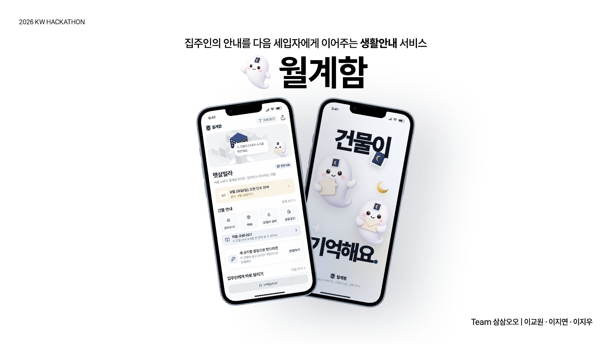
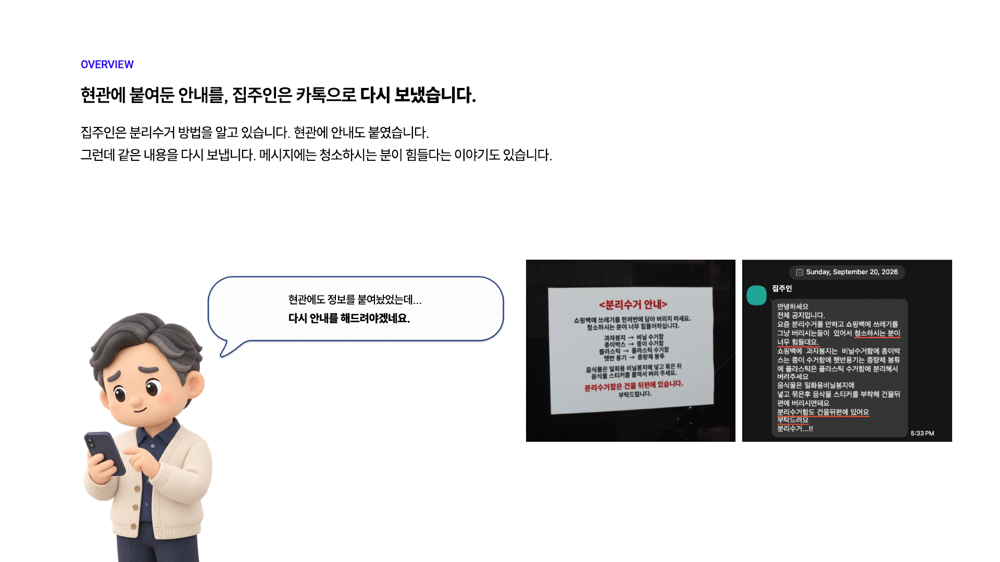
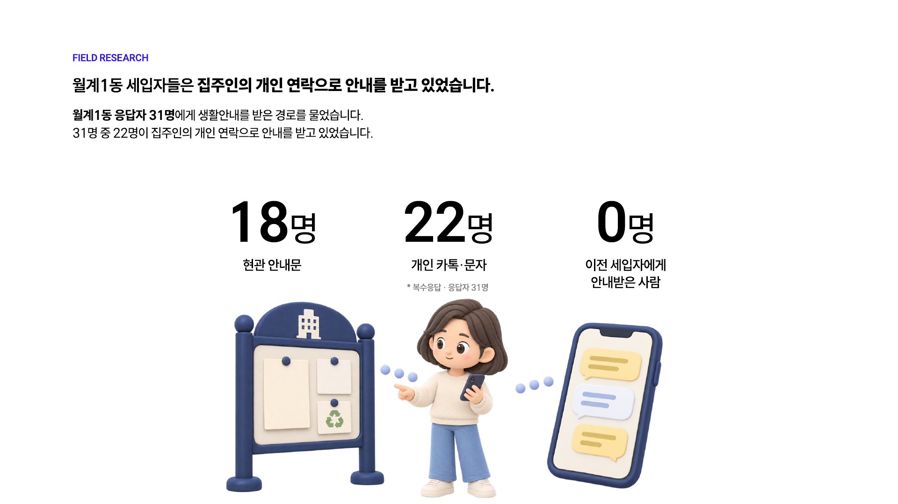
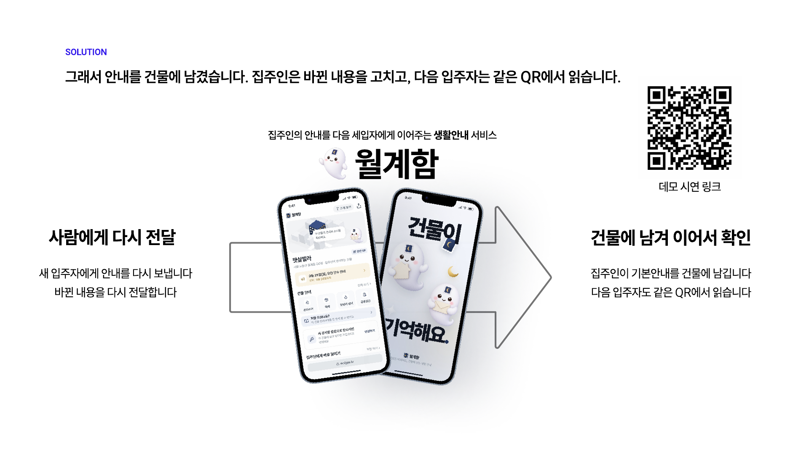
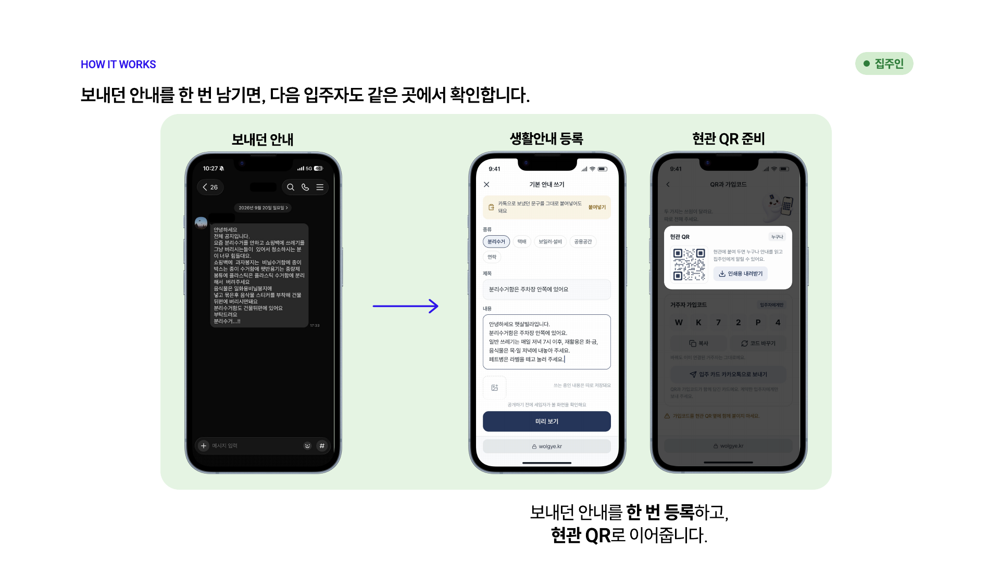
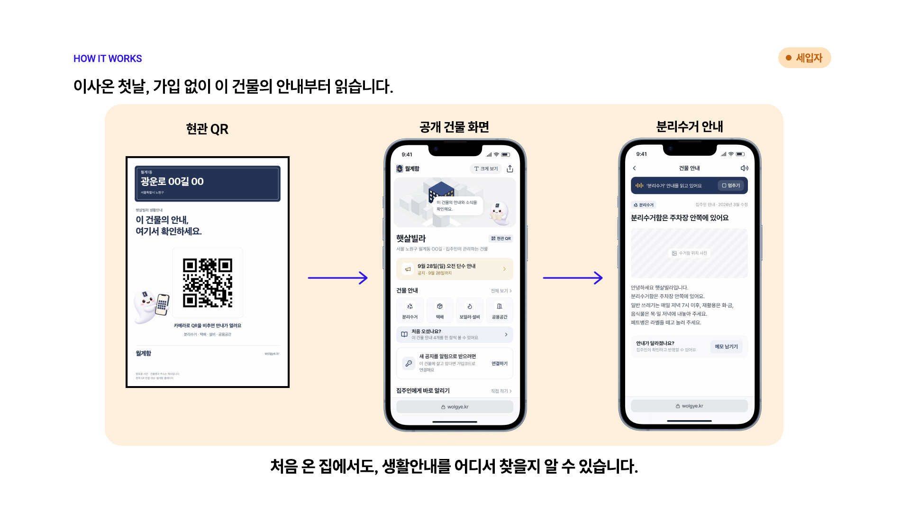
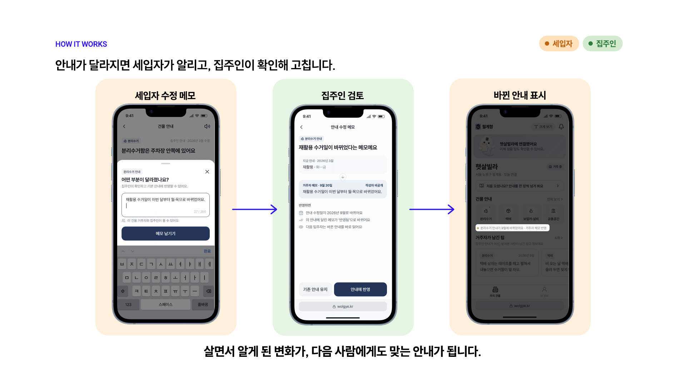
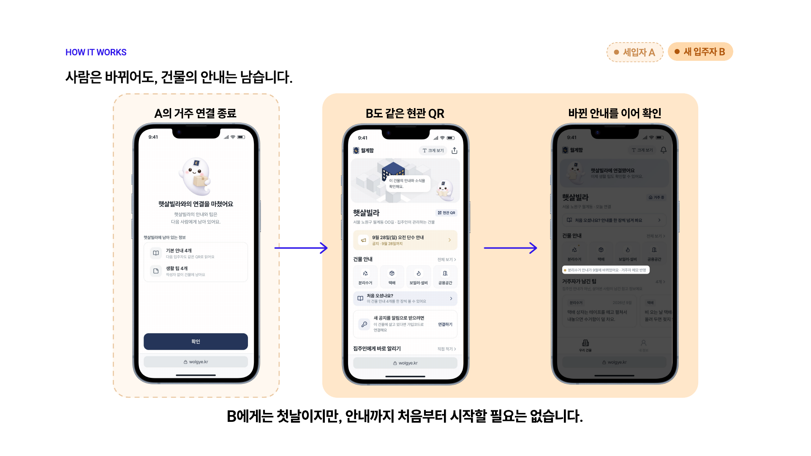
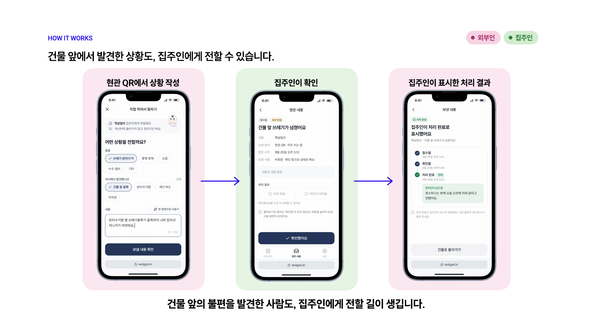
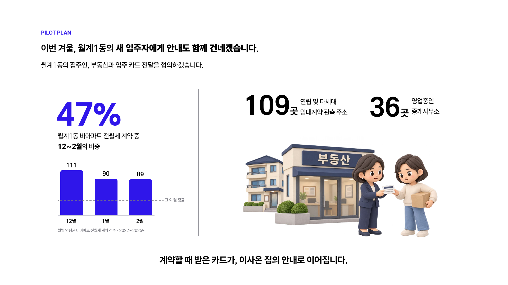

# 월계함

<p align="center">
  <strong>집주인의 안내를 다음 세입자에게 이어주는 생활안내 서비스</strong>
</p>

<p align="center">
  
</p>

<p align="center">
  <a href="https://main.d3oykk6yk6i4p7.amplifyapp.com/demo"><strong>역할별 데모 체험</strong></a>
  ·
  <a href="https://main.d3oykk6yk6i4p7.amplifyapp.com/b/5a3e1c9d-2b47-4f86-9d10-7c2e5b8a4f01">공개 건물 화면</a>
  ·
  <a href="https://main.d3oykk6yk6i4p7.amplifyapp.com/api/docs">API 문서</a>
  ·
  <a href="docs/product.md">제품 기획 상세</a>
</p>

월계함은 관리사무소 없이 집주인이 직접 안내를 맡는 월계1동 소규모 임대건물을 위한 모바일 웹 서비스입니다. 집주인이 한 번 남긴 생활안내는 건물의 현관 QR에 남고, 사람이 바뀌어도 다음 입주자가 같은 곳에서 이어서 읽습니다.

## 문제에서 시작했습니다

집주인은 현관에 붙인 분리수거 안내를 세입자에게 개인 카톡으로 다시 보냈습니다. 안내는 건물에 남아 있었지만 지금 사는 사람에게 닿는 경로와 분리돼 있었습니다.

월계1동 세입자 31명에게 생활안내를 받은 경로를 물었을 때 22명이 개인 카톡·문자를 꼽았고, 이전 세입자에게 안내를 받은 사람은 없었습니다.

<p align="center">
  
  
</p>

> 이미 알려준 안내를, 다음 사람도 이어서 확인할 수 없을까요?

## 그래서 안내를 건물에 남겼습니다

건물 하나에 공개 페이지 하나와 현관 QR 하나를 둡니다. 집주인은 보내던 안내를 한 번 등록하고 바뀐 내용을 고칩니다. 새 입주자는 가입하기 전에 필요한 안내부터 읽습니다.

<p align="center">
  
</p>

## 핵심 경험

### 1. 집주인은 보내던 안내를 한 번 남깁니다

카톡으로 보내던 내용을 붙여 넣어 생활안내를 만들고, 공개 전에 세입자 화면으로 확인한 뒤 현관 QR과 입주 카드를 준비합니다.

<p align="center">
  
</p>

### 2. 세입자는 이사 온 첫날, 가입 없이 읽습니다

현관 QR을 열면 건물의 공개 화면과 분리수거·택배·보일러·공용공간 안내를 바로 확인합니다. 알림이 필요할 때만 가입코드로 건물에 연결합니다.

<p align="center">
  
</p>

### 3. 달라진 안내는 세입자가 알리고 집주인이 고칩니다

세입자는 실제 생활과 다른 내용을 수정 메모로 남깁니다. 집주인은 메모를 확인해 안내에 반영하거나 기존 안내를 유지할 수 있습니다.

<p align="center">
  
  
</p>

### 4. 건물 앞에서 발견한 상황도 집주인에게 닿습니다

외부인도 가입하지 않고 비긴급 공용생활 상황을 보낼 수 있습니다. 집주인이 확인하고 처리 결과를 표시하면 보낸 사람은 같은 브라우저나 확인 링크에서 상태를 다시 봅니다.

<p align="center">
  
</p>

## 역할별 데모

[시연 시작 화면](https://main.d3oykk6yk6i4p7.amplifyapp.com/demo)에서 같은 햇살빌라 데이터를 네 역할로 이어서 볼 수 있습니다.

| 역할 | 확인할 수 있는 흐름 |
|---|---|
| 입주자 A | 공지·건물 안내·생활 팁·거주 연결 종료 |
| 옆 건물 주민 | 가입하지 않은 외부인의 제보와 처리 상태 |
| 집주인 | 기본 안내·공지·수정 메모·받은 내용 관리 |
| 다음 입주자 B | 가입코드 연결과 이전 사람에게서 이어진 안내 |

## 구현된 기능

- 건물 공개 페이지와 현관 QR, 인쇄용 입주 카드
- 집주인 초대, 건물 확인, 안내 작성·미리 보기·공개
- 6자리 가입코드, 카카오 로그인, 약관 동의, 거주 연결
- 공지 작성·기간 관리·웹 푸시 알림·열람 기록
- 수정 메모 검토, 안내 수정본 공개, 거주 재확인·이사
- 비회원 제보 재조회, 집주인 확인·처리 결과
- 거주자 생활 팁 작성·수정·삭제·신고
- 크게 보기, 읽어주기, 오류·빈 상태, 역할 전환 시연

## 기술 구성

| 영역 | 사용 기술 |
|---|---|
| Web | React 19, TypeScript, Vite, React Router, TanStack Query, SEED Design |
| API | Hono, Zod, Drizzle ORM, PostgreSQL |
| Auth·Notification | Kakao OAuth, 세션 쿠키, Web Push·VAPID |
| Infrastructure | AWS Amplify, CloudFront, EC2, ECR, SSM, S3, Caddy |
| Quality | Vitest, Playwright, Biome, GitHub Actions |

프론트엔드와 백엔드는 [packages/contracts](packages/contracts)를 통해 요청·응답 스키마를 공유합니다. 브라우저에서 CloudFront를 거쳐 서버까지 HTTPS로 연결하고, dev와 prod 데이터베이스를 분리합니다.

## 로컬 실행

Node 24와 pnpm 10.28.2를 사용합니다.

```bash
pnpm install
cp apps/api/.env.example apps/api/.env
cp apps/web/.env.example apps/web/.env
pnpm db:up
pnpm db:migrate
pnpm db:seed
pnpm dev
```

- Web: `http://localhost:5173`
- API: `http://localhost:3001/api`
- Swagger: `http://localhost:5173/api/swagger`
- 전체 검증: `pnpm check`
- 브라우저 E2E: `pnpm e2e`

## 배포

- 시연·개발: https://main.d3oykk6yk6i4p7.amplifyapp.com/demo
- 실제 서비스: https://release.dfldu21sxhojf.amplifyapp.com
- dev API 상태: https://main.d3oykk6yk6i4p7.amplifyapp.com/api/health
- prod API 상태: https://release.dfldu21sxhojf.amplifyapp.com/api/health

`main`은 dev, `release`는 prod로 배포됩니다. API 배포는 검사·이미지 빌드·DB 마이그레이션·상태 확인을 거치며 실패하면 직전 이미지로 되돌립니다.

## 파일럿 계획

월계1동 비아파트 전월세 계약의 47%가 12~2월에 몰립니다. 이번 겨울에는 집주인·부동산과 입주 카드 전달을 협의하고, 새 입주자가 안내를 스스로 찾는지 실제 입주 현장에서 확인하려 합니다.

<p align="center">
  
</p>

## 문서

- [제품 기획 상세](docs/product.md)
- [화면 흐름과 개발 계약](lofi/screens.md)
- [로파이 보드](lofi/board.html)
- [함이 캐릭터 가이드](design/characters/hami/README.md)
- [프론트엔드 개발 가이드](docs/frontend.md)
- [백엔드·API 가이드](docs/backend.md)
- [시스템 구조](docs/architecture.md)
- [배포와 운영](docs/deploy.md)
- [협업 가이드](CONTRIBUTING.md)
- [README 이미지 관리](docs/assets/pdf-pages/README.md)

## 팀 삼삼오오

| 이름 | 담당 |
|---|---|
| [이교원](https://github.com/kyowon1108) | Product, UX/UI, Infrastructure |
| [이지연](https://github.com/bborang) | Frontend |
| [이지우](https://github.com/dlwldn4824) | Backend |

---

<p align="center">
  <strong>사람은 바뀌어도, 건물의 안내는 남습니다.</strong>
</p>
