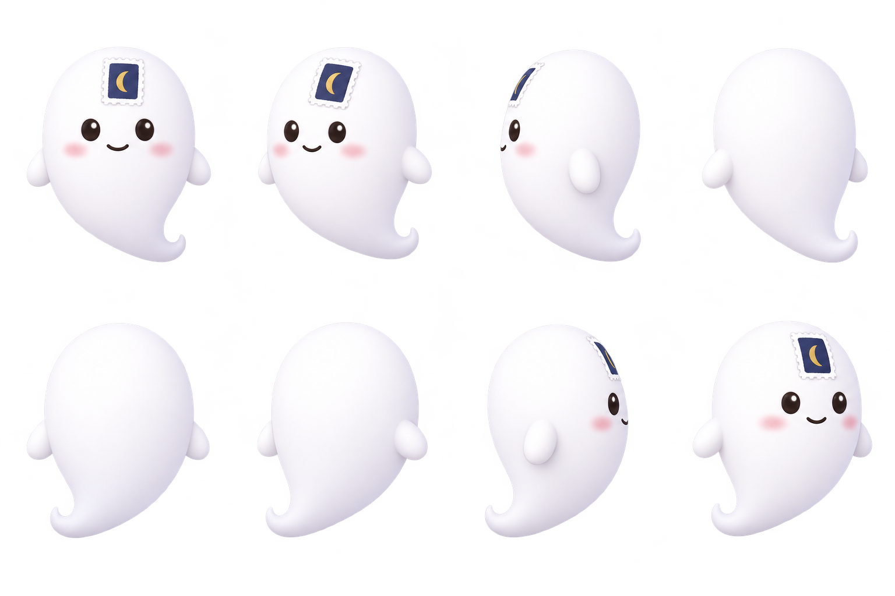

# 함이 캐릭터 제작 가이드

## 1. 함이 소개



외형 기준은 따뜻한 흰색의 둥근 몸체, 짧은 지느러미 팔, 말린 꼬리, 둥근 어두운 눈, 연한 분홍 볼, 이마의 남색 우표와 금빛 초승달입니다. 얼굴과 우표는 앞면에만 있습니다.

## 2. 관리 위치

```text
design/characters/hami/
├── README.md                          외형·사용·제작 가이드
├── PROMPTS.md                         기준·변형 프롬프트와 결과
└── images/
    ├── hami-turnaround-transparent.png 외형 기준
    ├── hami-user-reference.png         최초 참고
    └── guide.png … wave.png            개별 포즈 13종

lofi/assets/hami/
└── guide.png … wave.png                검토한 현재 사용본 사본
```

## 3. 제작 원칙

1. [PROMPTS.md](PROMPTS.md)의 공통 템플릿에 행동·몸의 방향·시선·카메라·구도를 넣습니다. 턴어라운드는 외형 기준이며 정면 자세를 강제하는 자료가 아닙니다.
2. 한 포즈씩 1:1 투명 PNG로 생성합니다. 일반 장면은 전신, hami-mini만 상반신입니다. 얼굴·우표·팔·꼬리·소품과 여백을 확인합니다.
3. 안내·저장·이사는 동작과 사선 구도, 접수·알림 선택은 안정적인 구도를 사용합니다. 행동하는 물체를 자연스럽게 바라보게 합니다.
4. 소품은 크림색, 포인트는 남색·금색으로 제한합니다. 입체감은 내부 음영과 겹침으로 만들고 외부 그림자·후광은 넣지 않습니다.
5. tip-saved를 먼저 만든 뒤 tray-empty의 소품 참고로 함께 첨부합니다. 보관함의 색·모서리·깊이를 유지합니다.
6. 흰색과 연한 남색(#EEF1F7) 카드에서 실제 표시 크기로 확인합니다. 알파 채널·실루엣 여백도 검사합니다. RGB만 보여주는 미리보기로 투명 여부를 판단하지 않습니다.
7. 통과한 결과만 images/에 저장하고 같은 파일명으로 lofi/assets/hami/에 복사합니다. 요청·결과·검토 상태는 PROMPTS.md에 기록합니다. 중간 버전 폴더와 과거 프롬프트를 누적하지 않습니다.

## 4. 화면별 포즈

괄호 안 숫자는 lofi/screens의 파일 번호입니다. 이미지 폭은 투명 여백을 포함한 CSS 픽셀이며, 여백만큼 음수 여백으로 당겨 배치합니다.

| 파일 | 화면 | 이미지 폭 | 장면 |
|---|---|---|---|
| `guide.png` | LF-01 공개 첫 화면(01) · 처음 오셨나요(36·46) | 104 · 72 | 펼친 안내책을 든 기존 포즈 유지 |
| `house.png` | LF-05 B 연결 직후(10) · LF-09 거주 재확인(40) | 104 · 140 | 집 카드를 보여주며 반대 팔로 환영 |
| `envelope.png` | LF-10 받는 사람 카드(05) · LF-11 접수(06) | 80 · 100 | 봉한 봉투를 차분히 받침 |
| `hami-splash-screen.png` | 스플래시(00) 전체 화면 합성 원본 | 1170×2532 | `house` 포즈와 턴어라운드 외형을 기준으로 만든 9:19.5 장면 |
| `tip-saved.png` | LF-02 수정 메모를 남긴 뒤(13) | 150 | 큰 보관함으로 메모를 내려놓는 동작 |
| `moving.png` | LF-09 이사 처리 완료(09) | 172 | 상자를 들고 손 흔드는 기존 포즈 유지 |
| `hami-mini.png` | LF-06 팁 저장 토스트(04) 등 40pt 이하 | 40 | 우표·눈·볼이 읽히는 정면 상반신 |
| `folder.png` | LF-02 안내 없음(14) | 150 | 빈 폴더를 든 기존 포즈 유지 |
| `tray-empty.png` | LF-06 생활 팁 없음(18) | 150 | tip-saved와 같은 빈 보관함 |
| `bell.png` | LF-04 연결 뒤 알림 선택·홈 화면 추가 안내(17) · LF-09 알림 설정(예정) | 112 | 울리지 않는 종을 조심스럽게 받침 |
| `clipboard.png` | LF-12 건물 확인(23) | 118 | 보드를 보며 연필로 기록하려는 순간 |
| `qr-sign.png` | LF-18 현관 QR과 입주 카드(26) | 104 | 아이폰 13 느낌의 스마트폰 화면을 가리킴 |
| `lost.png` | 건물 없음(22) · 링크 만료·불러오기 실패(예정) | 150 | 빈손과 과장 없는 궁금한 표정 |
| `wave.png` | LF-20 데모 시작(29) | 110 | 몸을 살짝 돌려 손 흔들기 |

거주 재확인에는 별도 포즈(house-ask)를 만들지 않고 `house.png`를 함께 씁니다. 재방문한 공개 화면(30)과 거주자 홈 재방문(03)에는 함이를 넣지 않습니다. 집주인 시작(41)·처음 관리 홈(42)·공개 전 확인(43)·연결 필요(44)·내 정보(45)에도 넣지 않습니다.

LF-03·14·15·16·17·19에는 함이를 추가하지 않습니다. 확인함·처리 완료·처리가 어려움은 텍스트와 배지로 설명합니다. 접수 포즈가 확인이나 해결을 약속하지 않게 하고 집 카드를 인증 배지처럼 표현하지 않습니다. 스마트폰 화면의 4×4 추상 격자는 실제 QR로 사용하지 않습니다.
