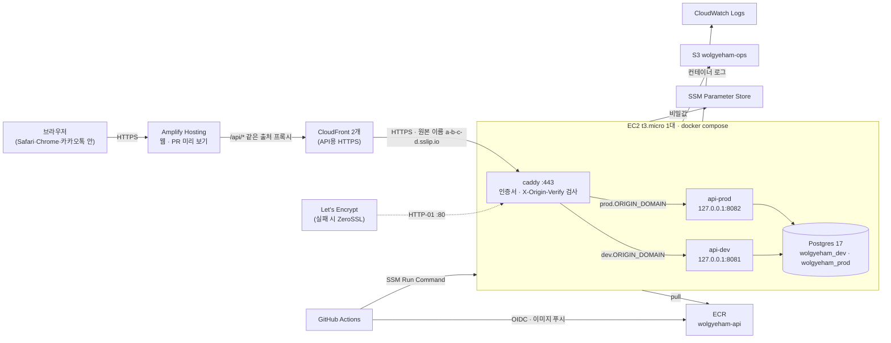

# 시스템 구조

월계함이 어디서 어떻게 돌아가는지 정리합니다. 배포 방법은 [deploy.md](deploy.md), AWS를 처음 준비하는 절차는 [aws-setup.md](aws-setup.md)를 봅니다.

- 기준: [README.md](../README.md)(무엇을 왜), [lofi/screens.md](../lofi/screens.md)(화면·권한·데이터 계약), [decisions.md](decisions.md)(구조 결정)
- 담당: 공통 계약·인프라·통합 영역 (`infra`, `.github`, 루트 설정)

## 한 장으로 보기

- 웹과 API는 **모든 환경에서 같은 출처**입니다. 로컬은 Vite 프록시, 배포 환경은 Amplify의 `/api/*` 재작성 규칙이 API로 넘깁니다. 그래서 CORS 설정이 없고, 로그인 쿠키가 iOS Safari에서도 제3자 쿠키로 막히지 않습니다.
- API 문서는 dev에서 `/api/swagger`(Swagger UI), `/api/docs`(Scalar), `/api/openapi.json`으로 봅니다. prod는 `API_DOCS=true`를 설정했을 때만 열립니다.

## 환경

| 환경 | 웹 | API·DB | 언제 바뀌나 | 카카오 로그인 |
|---|---|---|---|---|
| local | `pnpm dev` (Vite) | 내 컴퓨터의 API + `pnpm db:up` Postgres | 저장할 때 | 가능 (localhost 등록) |
| preview | Amplify dev 앱의 PR 미리 보기 | dev API를 같이 씀 | PR에 커밋을 올릴 때 | 안 됨 (주소가 PR마다 바뀜). 비로그인 흐름으로 확인 |
| dev | Amplify dev 앱 (`main`) | EC2 `api-dev` + `wolgyeham_dev` | `main`에 병합할 때 | 가능 |
| prod | Amplify prod 앱 (`release`) | EC2 `api-prod` + `wolgyeham_prod` | 관리자가 `release`를 올릴 때 | 가능 |

dev 웹은 Amplify의 GitHub 연결이 빌드합니다. prod 웹은 GitHub Actions가 API 배포 성공 뒤 같은 `release`의 정적 빌드를 Amplify에 올립니다(D-33).

- dev는 팀이 매일 확인하는 곳이고 데이터가 초기화될 수 있습니다.
- prod는 파일럿 건물의 실제 사용자가 씁니다. 실제 사용자 데이터가 들어가므로 초기화하지 않고, 시연용 시드를 넣지 않습니다.
- 시연 모드(LF-20)와 가상 건물 '햇살빌라' 시드는 local과 dev에서만 씁니다. 본선 시연과 전시는 `main`을 동결한 dev에서 합니다.

## 구성 요소

| 구성 | 쓰는 서비스 | 역할 | 비용 메모 |
|---|---|---|---|
| 웹 | AWS Amplify Hosting 앱 2개 | 빌드·호스팅·PR 미리 보기·`/api` 프록시 | 사용량이 작아 월 1달러 미만 예상 |
| API 입구 | CloudFront 배포 2개 | API에 HTTPS 주소 제공, 캐시 안 함 | 상시 무료 한도(월 1TB) 안 |
| 원본 HTTPS | EC2 안의 caddy + sslip.io 이름 + Let's Encrypt(대체 ZeroSSL) | CloudFront → EC2 구간 암호화, 원본 확인 헤더 검사(D-31) | 무료. 메모리 64MB 제한 |
| API·DB | EC2 t3.micro 1대 + EBS 20GB + 탄력적 IP | docker compose로 api-dev, api-prod, Postgres, caddy | 프리 티어 대상 크기. 계정 플랜에 따라 무료 또는 크레딧 차감 |
| 이미지 | ECR `wolgyeham-api` | API 이미지 보관 (최근 10개) | 수백 MB 이하 |
| 비밀값 | SSM Parameter Store (표준) | 카카오 키, 세션 비밀, DB 비밀번호 | 표준 파라미터 무료 |
| 백업·서버 파일 | S3 `wolgyeham-ops-<계정ID>` | 매일 pg_dump(14일 보관), 서버 스크립트 | 수 MB |
| 로그 | CloudWatch Logs `/wolgyeham/dev`, `/wolgyeham/prod` | 컨테이너 로그, 14일 보관 | 무료 한도 안 |
| 권한 | IAM Identity Center, GitHub OIDC 역할 | 사람은 SSO, 배포는 키 없이 | 무료 |
| 비용 감시 | AWS Budgets | 월 5달러 예산. 실제 1달러 또는 예상 5달러를 넘으면 메일 | 무료 |

2025년 7월 이후 만든 AWS 계정은 12개월 무료 대신 크레딧 방식(6개월)입니다. 어느 쪽인지는 [aws-setup.md](aws-setup.md) 0단계에서 확인합니다.

## 요청 흐름

1. 세입자가 현관 QR을 열면 Amplify가 웹을 줍니다.
2. 웹이 `/api/buildings/...`를 부르면 Amplify가 같은 경로를 CloudFront(API)로 넘기고, CloudFront가 HTTPS로 EC2의 caddy(`dev.<ORIGIN_DOMAIN>` 또는 `prod.<ORIGIN_DOMAIN>`)에 보냅니다. caddy는 `X-Origin-Verify`가 그 환경 값이면 `api-dev` 또는 `api-prod`로 넘기고, 아니면 403입니다. `X-Forwarded-For`는 CloudFront가 만든 그대로 넘깁니다.
3. API는 요청을 zod(`packages/contracts`)로 검증하고, 이 건물과의 관계로 권한을 확인한 뒤 Postgres를 읽고 씁니다.
4. 로그인은 API가 카카오와 직접 주고받고, 세션 쿠키 `wh_session`을 웹과 같은 출처로 내려줍니다.
5. 응답 로그는 CloudWatch Logs로 갑니다.

API 응답은 캐시하지 않습니다. CloudFront는 캐시를 끈 정책을 쓰고, API는 응답에 `Cache-Control: no-store`를 붙입니다.

## 한계와 위험

| 항목 | 내용 | 대응 |
|---|---|---|
| 단일 서버 | EC2가 멈추면 dev와 prod가 같이 멈춥니다 | 본선·전시 전날 백업과 복구를 한 번 연습합니다. 가용성이 필요해지면 [decisions.md](decisions.md) D-02를 다시 봅니다 |
| 메모리 | t3.micro는 1GB입니다 | 스왑 1GB, 컨테이너별 메모리 제한(Postgres 320MB, API 256MB×2, caddy 64MB), Postgres 설정을 작게 둡니다 |
| CloudFront→EC2 구간 | caddy가 HTTPS로 받습니다. 원본 이름은 외부 서비스 sslip.io에 기대고, 인증서는 80번으로 발급·갱신합니다 | 443은 CloudFront에서만, 80은 인증서 확인과 HTTPS 안내만 합니다. sslip.io나 발급에 문제가 생기면 [deploy.md](deploy.md) 되돌리기, 팀 도메인이 생기면 [aws-setup.md 7-A](aws-setup.md#7-a-원본-https로-옮기기-이미-돌고-있는-환경)로 이름만 바꿉니다 |
| 미리 보기 로그인 | PR 미리 보기 주소는 카카오에 등록할 수 없습니다 | 로그인 흐름은 dev에서 확인합니다 |
| 개인정보 | prod에 카카오 계정 연결, 제보 내용이 쌓입니다 | 로그에 남기지 않고, 백업은 14일 뒤 지우고, 전시 뒤 [aws-setup.md](aws-setup.md)의 정리 절차를 따릅니다 |

## 바꿀 때

구조를 바꾸면 이 문서, [decisions.md](decisions.md), 관련 설정 파일(`infra/`, `.github/workflows/`, `amplify.yml`)을 같은 PR에서 고칩니다.
