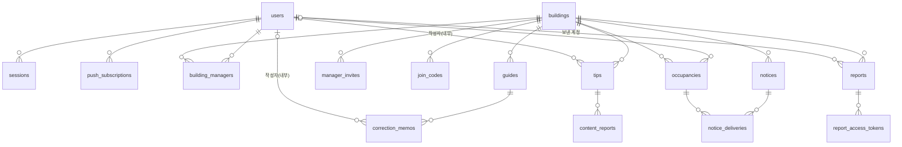

# 데이터베이스 가이드

월계함의 PostgreSQL 스키마 규칙, 테이블 구성, 마이그레이션·시드·백업 방법입니다. 새 테이블과 컬럼은 이 문서의 규칙으로 만듭니다.

기준: [lofi/screens.md §2 데이터 귀속](../lofi/screens.md#2-데이터-귀속)·[§3 상태 전이](../lofi/screens.md#3-상태-전이)·[§4 작성자 정책](../lofi/screens.md#4-작성자-정책), `packages/contracts` · 담당 영역: 백엔드 `apps/api`, 공통 계약 `packages/contracts` ([CONTRIBUTING.md §2](../CONTRIBUTING.md#2-담당-영역))

함께 읽기: [backend.md](backend.md) · [architecture.md](architecture.md) · [deploy.md](deploy.md) · [decisions.md](decisions.md)

## 1. 현재 상태

| 항목 | 상태 |
|---|---|
| 로컬 PostgreSQL 17 (`infra/compose.yaml`, `127.0.0.1:54329`, DB `wolgyeham`) | 있음 (`pnpm db:up`, `pnpm db:down`) |
| `DATABASE_URL` 샘플 | `apps/api/.env.example`에 있음. 코드에서는 아직 쓰지 않음 |
| Drizzle ORM + drizzle-kit, `apps/api/src/db/schema.ts`, `apps/api/drizzle/` | 결정함([decisions.md](decisions.md) D-05), 아직 구현 전 (패키지 미설치) |
| 스크립트 `db:generate`, `db:migrate`, `db:seed` | 아직 구현 전. 루트 `package.json`의 `db:up` 옆에 추가 |
| 테스트 DB `wolgyeham_test` | 아직 구현 전 |

```bash
pnpm db:up    # Postgres 컨테이너 시작 (healthcheck 통과까지 대기)
docker compose -f infra/compose.yaml exec db psql -U wolgyeham wolgyeham        # 접속
docker compose -f infra/compose.yaml exec db createdb -U wolgyeham wolgyeham_test # 테스트 DB 한 번 생성
```

## 2. 도구와 위치

| 대상 | 위치 |
|---|---|
| 스키마 (Drizzle) | `apps/api/src/db/schema.ts` |
| 생성된 SQL 마이그레이션 | `apps/api/drizzle/` (커밋함) |
| DB 클라이언트 | `apps/api/src/lib/db.ts` |
| 공개 API 스키마 | `packages/contracts`. drizzle-zod로 insert 스키마를 만들 수는 있지만 API 계약은 contracts에만 둠 |

## 3. 명명·컬럼 규칙

| 항목 | 규칙 |
|---|---|
| 테이블 | snake_case 복수형 (`correction_memos`) |
| 기본 키 | `id uuid primary key default gen_random_uuid()` |
| 시각 | `created_at`, `updated_at`: `timestamptz not null default now()`. 다른 시각도 `timestamptz` (`published_at`, `expires_at`) |
| 상태 | `text` + CHECK. Postgres enum은 쓰지 않음. 값 목록은 contracts의 zod enum과 같게 둠 |
| 외래 키 | `<대상 단수>_id`. `ON DELETE`를 항상 명시 (`cascade` 또는 `set null`) |
| 유니크 | `<table>_<cols>_key` (예: `users_kakao_user_id_key`) |
| 인덱스 | `<table>_<cols>_idx`. 조회에 쓰는 외래 키마다 둠 |
| 글자 수 제한 | `CHECK (char_length(body) <= N)`과 contracts의 `z.string().max(N)`을 함께 둠 |
| 비밀·토큰 | SHA-256 해시만 저장 (`token_hash`). 예외는 §7 |

- 호수(방 번호) 컬럼은 어디에도 두지 않습니다. 사람과 건물의 관계만 다룹니다.
- DB 컬럼은 snake_case, API 필드는 camelCase입니다. 변환은 `repo.ts`에서 합니다.
- 월 단위 표시(팁 작성 월 등)는 `Asia/Seoul` 기준으로 계산합니다. 저장은 `timestamptz`입니다.

```ts
// apps/api/src/db/schema.ts (형태 예시, 아직 구현 전)
import { GUIDE_STATUSES } from "@wolgyeham/contracts";
import { sql } from "drizzle-orm";
import { check, index, pgTable, text, timestamp, uuid } from "drizzle-orm/pg-core";

const timestamps = {
  createdAt: timestamp("created_at", { withTimezone: true }).notNull().defaultNow(),
  updatedAt: timestamp("updated_at", { withTimezone: true }).notNull().defaultNow(),
};

export const guides = pgTable(
  "guides",
  {
    id: uuid("id").primaryKey().defaultRandom(),
    buildingId: uuid("building_id")
      .notNull()
      .references(() => buildings.id, { onDelete: "cascade" }),
    title: text("title").notNull(),
    body: text("body").notNull(),
    status: text("status", { enum: GUIDE_STATUSES }).notNull().default("draft"),
    publishedAt: timestamp("published_at", { withTimezone: true }),
    ...timestamps,
  },
  (t) => [
    check("guides_status_check", sql`${t.status} in ('draft', 'published')`),
    index("guides_building_id_status_idx").on(t.buildingId, t.status),
  ],
);
```

## 4. 테이블

[screens.md §2 데이터 귀속](../lofi/screens.md#2-데이터-귀속)의 엔터티를 테이블로 옮긴 초안입니다. 모든 테이블에 `id`, `created_at`, `updated_at`이 있으므로 표에서는 뺍니다. 괄호 안은 `ON DELETE` 동작입니다.



**계정**

| 테이블 | 주요 컬럼 | 제약·인덱스 |
|---|---|---|
| `users` | `kakao_user_id text` | `users_kakao_user_id_key`. 닉네임·프로필 사진·실명은 저장하지 않음 |
| `sessions` | `user_id`(cascade), `token_hash`, `expires_at`, `last_seen_at` | `sessions_token_hash_key`, `sessions_user_id_idx` |
| `push_subscriptions` | `user_id`(cascade), `endpoint`, `p256dh`, `auth` | `push_subscriptions_endpoint_key`, `push_subscriptions_user_id_idx`. 브라우저마다 한 행 |

**건물·관리·연결**

| 테이블 | 주요 컬럼 | 제약·인덱스 |
|---|---|---|
| `buildings` | `name`, `display_address`(도로명까지), `full_address`(팀 확인값, 공개 안 함), `status` preparing·open, `opened_at` | CHECK `status` |
| `manager_invites` | `building_id`(cascade), `token_hash`, `status` issued·accepted·expired, `expires_at`, `accepted_by_user_id`(set null), `accepted_at` | `manager_invites_token_hash_key`, CHECK `status`. 초대 유효 기간은 정할 것 |
| `building_managers` | `building_id`(cascade), `user_id`(cascade), `invite_id`(set null) | `building_managers_building_id_user_id_key`, `building_managers_user_id_idx` |
| `join_codes` | `building_id`(cascade), `code`, `created_by_user_id`(set null), `retired_at` | 현재 코드는 `retired_at is null`. 건물마다 하나: 부분 유니크 `join_codes_building_id_current_key` |
| `occupancies` | `building_id`(cascade), `user_id`(cascade), `status` active·reconfirm_needed·inactive, `connected_at`, `last_reconfirmed_at`, `next_reconfirm_at`, `ended_at` | CHECK `status`. 사용자마다 살아 있는 연결 하나: 부분 유니크 `occupancies_user_id_live_key` (`status <> 'inactive'`), `occupancies_building_id_status_idx` |

**안내·공지**

| 테이블 | 주요 컬럼 | 제약·인덱스 |
|---|---|---|
| `guides` | `building_id`(cascade), `category`, `title`, `body`, `photos jsonb`, `position`, `status` draft·published, `published_at`, `author_user_id`(set null) | CHECK `status`, CHECK `status = 'draft' or published_at is not null`, `guides_building_id_status_idx` |
| `correction_memos` | `guide_id`(cascade), `author_user_id`(set null), `body` ≤200, `status` pending·applied·kept, `kept_reason`, `resolved_at` | CHECK 글자 수·`status`, CHECK `status <> 'kept' or kept_reason is not null`, `correction_memos_guide_id_status_idx` |
| `notices` | `building_id`(cascade), `title`, `body`, `starts_at`, `ends_at`, `status` published·expired, `author_user_id`(set null), `published_at` | CHECK `ends_at >= starts_at`, `notices_building_id_ends_at_idx` |
| `notice_deliveries` | `notice_id`(cascade), `occupancy_id`(cascade), `attempted_at`, `opened_at` | `notice_deliveries_notice_id_occupancy_id_key`. 행 하나가 알림 대상 한 명 |

**제보·팁**

| 테이블 | 주요 컬럼 | 제약·인덱스 |
|---|---|---|
| `reports` | `building_id`(cascade), `reporter_user_id`(set null), `reporter_kind` guest·resident, `kind`, `location`, `body` ≤300, `photos jsonb`, `status` received·acknowledged·completed·unable, `result_note`, `acknowledged_at`, `resolved_at` | CHECK 글자 수·`status`, `reports_building_id_status_idx`, `reports_reporter_user_id_idx` |
| `report_access_tokens` | `report_id`(cascade), `token_hash`, `expires_at`(발급 후 30일) | `report_access_tokens_token_hash_key`, `report_access_tokens_report_id_idx` |
| `tips` | `building_id`(cascade), `author_user_id`(set null), `category`, `body` ≤200, `hidden_at` | CHECK 글자 수, `tips_building_id_idx`, `tips_author_user_id_idx` |
| `content_reports` | `tip_id`(cascade), `reporter_user_id`(set null), `status` | `content_reports_tip_id_reporter_user_id_key`. `status` 값은 LF-19 설계 후 정할 것 |

- `category`(안내·팁), `kind`(제보의 자주 쓰는 말) 값 목록은 정할 것입니다. 정하면 contracts enum과 CHECK를 같은 PR에 넣습니다.
- 사진 파일의 저장 위치는 정할 것입니다. DB에는 파일 키 목록(`photos jsonb`)만 둡니다.
- 공개된 안내를 고치는 동안 초안을 어디에 둘지(같은 행의 별도 컬럼 또는 공개 요청에 전체 내용 전달)는 정할 것입니다. 어느 방식이든 공개가 실패하면 공개된 내용과 메모 상태는 그대로입니다.
- 공개 건물 URL은 `buildings.id`(uuid v4)를 씁니다. 더 짧은 공개 키가 필요하면 정할 것입니다.
- `reporter_kind`는 제보 시점의 스냅숏입니다. 집주인 화면의 ‘비회원’·‘거주자’ 표시에만 씁니다.

## 5. 상태 전이는 어디서 지키나

전이 순서와 의미는 [screens.md §3](../lofi/screens.md#3-상태-전이)가 기준입니다. DB는 허용 값과 필수 짝만 막고, 순서와 조건은 서비스가 지킵니다.

| 대상 | 서비스 (`service.ts`) | DB 제약 |
|---|---|---|
| `buildings` preparing → open | 첫 안내 공개와 같은 트랜잭션. 되돌리지 않음 | CHECK 값 |
| `guides` draft → published | 공개 엔드포인트에서만 | CHECK 값, `published_at` 필수 짝 |
| `manager_invites` issued → accepted·expired | 수락 시 만료 확인, 한 번만 수락 | CHECK 값, `token_hash` 유니크 |
| `occupancies` | 연결·재확인·이사·건물 전환. `next_reconfirm_at`(연결·재확인 뒤 1년) + 14일 무응답이면 reconfirm_needed | CHECK 값, 살아 있는 연결 하나 |
| `correction_memos` pending → applied·kept | applied는 안내 공개 트랜잭션 안에서만 | CHECK 값, kept면 `kept_reason` 필수 |
| `reports` received → acknowledged → completed·unable | 버튼 요청으로만. 조회로 바뀌지 않음, 역방향 없음 | CHECK 값 |
| `notices` published → expired | 만료 판단은 항상 `ends_at < now()` | CHECK `ends_at >= starts_at` |
| `notice_deliveries` 대상 → 시도 → 열람 | 행 생성, `attempted_at`, `opened_at`을 따로 기록 | (notice, occupancy) 유니크 |

- 전이는 `UPDATE ... WHERE status = '<이전 상태>'`로 하고, 바뀐 행이 0이면 409 `CONFLICT`입니다([backend.md §7](backend.md#7-도메인-규칙)).
- `reconfirm_needed` 전환과 `notices.status = 'expired'` 갱신을 요청 시점에 할지 주기 작업으로 할지는 정할 것입니다.

## 6. 마이그레이션

1. `schema.ts`를 고칩니다.
2. `db:generate`로 SQL을 만들고 `apps/api/drizzle/`의 생성 파일을 함께 커밋합니다. 생성된 SQL을 읽고 의도와 같은지 확인합니다.
3. `db:migrate`로 로컬 `wolgyeham`과 `wolgyeham_test`에 적용하고 테스트합니다.

- 이미 `main`에 들어간 마이그레이션 파일은 고치지 않고 새 마이그레이션을 추가합니다.
- 배포할 때 새 API가 시작되기 전에 마이그레이션이 자동으로 실행됩니다([deploy.md](deploy.md)).
- 데이터가 있는 컬럼을 지우거나 이름을 바꾸는 변경은 두 단계로 나눕니다: ① 새 컬럼 추가 + 코드가 새 컬럼을 쓰게 배포, ② 다음 PR에서 옛 컬럼 삭제. PR 본문에 영향과 단계를 적습니다.
- 상태 값을 추가하면 contracts enum, CHECK 마이그레이션, 서비스 전이를 같은 PR에서 고칩니다.
- 데이터 삭제·초기화는 영향을 팀에 공유한 뒤 사람이 실행합니다([CONTRIBUTING.md §9](../CONTRIBUTING.md#9-완료-기준)).

## 7. 환경별 DB

| 환경 | DB 이름 | 위치 |
|---|---|---|
| 로컬 개발 | `wolgyeham` | docker compose `db` 컨테이너 (`127.0.0.1:54329`) |
| 로컬 테스트 | `wolgyeham_test` | 같은 컨테이너. 서비스 테스트가 사용 |
| 배포 dev | `wolgyeham_dev` | EC2 호스트의 Postgres 컨테이너 하나 ([architecture.md](architecture.md)) |
| 배포 prod | `wolgyeham_prod` | 위와 같은 컨테이너 |

- 연결 문자열은 `DATABASE_URL` 하나로 받습니다. 로컬 값은 `apps/api/.env`, 배포 값은 SSM Parameter Store에 있습니다([deploy.md](deploy.md)).
- 테스트는 `DATABASE_URL`의 DB 이름만 `wolgyeham_test`로 바꿔 연결합니다. 설정 방법은 테스트 도입 PR에서 정합니다(아직 구현 전).

## 8. 시드·시연 데이터

- `db:seed`는 로파이의 가상 건물 ‘햇살빌라’ 데이터를 만듭니다: 공개된 기본 안내, 공지, 시연 역할(입주자 A, 다음 입주자 B, 집주인, 옆 건물 주민)의 사용자와 관계. 실제 사람·실제 주소·실제 가입코드는 넣지 않습니다.
- 시연 사용자의 `kakao_user_id`는 실제 카카오 회원번호와 겹치지 않는 값(예: `demo-a`)을 씁니다.
- 시드는 로컬·dev·시연 환경에서만 실행합니다. prod에서는 실행하지 않습니다.
- 시연 초기화(LF-20)는 시연용 건물 데이터만 되돌립니다.

## 9. 백업과 보관

- dev·prod는 매일 `pg_dump`로 S3에 백업하고 14일 보관합니다. 방법과 위치는 [deploy.md](deploy.md)와 [architecture.md](architecture.md)를 따릅니다.
- 본선 전에 백업을 복구해 보는 연습을 한 번 합니다(절차는 deploy.md).
- 제보 보관 기간은 정할 것입니다([README.md §12 POL-010](../README.md#12-정책)). 기간이 지난 제보와 조회 토큰을 지우는 작업은 아직 구현 전입니다. DB에서 지운 데이터도 백업 파일에는 최대 14일 남습니다.

## 10. 개인정보

| 항목 | 규칙 |
|---|---|
| 계정 | 카카오 회원번호만 저장합니다. 닉네임·프로필 사진은 필요해질 때 목적을 정하고 decisions.md에 남긴 뒤 추가합니다. 실명·전화번호는 받지 않습니다 |
| 해시 저장 | 세션, 집주인 초대, 제보 조회 토큰은 SHA-256 해시만 저장합니다 |
| 원문 저장 예외 | `join_codes.code`는 집주인이 다시 봐야 해서, 푸시 구독의 `p256dh`·`auth`는 알림을 암호화해 보내야 해서 원문으로 둡니다. 로그와 응답에는 필요한 곳 외에 내보내지 않습니다 |
| 작성자 | 팁·메모·제보의 작성자는 내부에만 저장합니다. 다른 거주자에게 보내는 응답에 작성자 ID를 넣지 않습니다 |
| 주소 | 공개 응답에는 `display_address`만 씁니다. `full_address`는 팀과 집주인만 봅니다 |
| 계정 삭제 | `users` 행을 지우면 세션·푸시 구독·연결·관리자 관계는 cascade로 지워지고, 팁·메모·제보의 작성자 연결은 `set null`로 끊깁니다. 삭제 화면과 절차는 정할 것입니다 |

## 바꿀 때

- 스키마와 이 문서는 PR로 바꿉니다. 테이블 구성, 명명 규칙, 보관 기간처럼 결정이 바뀌면 [decisions.md](decisions.md)에 기록합니다.
- 순서는 계약(`packages/contracts`의 enum·글자 수) → 스키마·마이그레이션 → API → 웹입니다. 계약을 깨는 변경은 양쪽을 같은 PR에서 고칩니다.
- 데이터 귀속과 상태 전이가 [lofi/screens.md](../lofi/screens.md)와 다르면 screens.md를 먼저 고칩니다.
